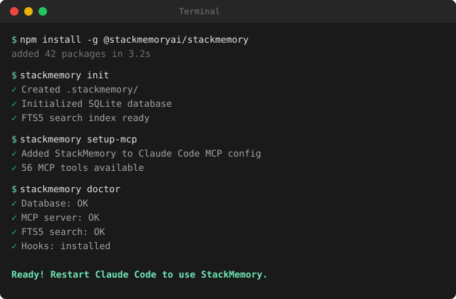

# StackMemory

[](https://github.com/stackmemoryai/stackmemory/actions/workflows/test-shared-context.yml)
[](https://github.com/stackmemoryai/stackmemory/actions/workflows/npm-publish.yml)
[](https://codecov.io/gh/stackmemoryai/stackmemory)
[](https://www.npmjs.com/package/@stackmemoryai/stackmemory)

Lossless, project-scoped memory for AI coding tools. **[Website](https://stackmemoryai.github.io/stackmemory/)** | **[MCP Tools](https://stackmemoryai.github.io/stackmemory/tools.html)** | **[Getting Started](./docs/GETTING_STARTED.md)**

<p align="center">
  
</p>

StackMemory is a **production-ready memory runtime** for AI coding tools that preserves full project context across sessions:

- **Zero-config setup** — `stackmemory init` just works
- **56 MCP tools** for Claude Code integration (context, tasks, Linear, traces, discovery, cord, team, planning, providers, and more)
- **FTS5 full-text search** with BM25 scoring and hybrid retrieval
- **Full Linear integration** with bidirectional sync and OAuth/API key support
- **Context persistence** that survives `/clear` operations
- **Hierarchical frame organization** (nested call stack model)
- **Multi-wrapper support** — `claude-sm`, `codex-sm`, `opencode-sm` with auto context loading
- **Skills system** with `/spec` and `/linear-run` for Claude Code
- **Automatic hooks** for task tracking, Linear sync, and spec progress
- **Snapshot capture** — post-run context snapshots for session handoff (`snapshot save`)
- **Pre-flight overlap check** — predict file conflicts before parallel task dispatch (`preflight`)
- **Conductor orchestrator** — polls Linear, creates worktrees, spawns agents with bounded concurrency and auto team detection
- **Loop/Watch command** — poll any shell command until a condition is met (monitor CI, deploys, logs)
- **Memory monitor daemon** with automatic capture/clear on RAM pressure
- **Auto-save service** for periodic context persistence
- **Comprehensive test coverage** across all core modules

Instead of a linear chat log, StackMemory organizes memory as a **call stack** of scoped work (frames), with intelligent LLM-driven retrieval and team collaboration features.

> **Memory is storage. Context is a compiled view.**

---

## Who is this for?

| You are... | StackMemory helps you... |
|------------|--------------------------|
| **Solo dev using Claude Code** | Keep decisions, constraints, and progress across sessions — no more re-explaining context after `/clear` |
| **Team using AI coding tools** | Share project context across agents and teammates with a single source of truth |
| **AI-first startup** | Ship faster with persistent memory, automatic Linear sync, and recursive task orchestration |
| **Open-source maintainer** | Onboard contributors and AI agents with durable project knowledge |

If you use an LLM coding assistant and lose context between sessions, StackMemory fixes that.

---

## Why StackMemory exists

Tools forget decisions and constraints between sessions. StackMemory makes context durable and actionable.

- Records: events, tool calls, decisions, and anchors
- Retrieves: high-signal context tailored to the current task
- Organizes: nested frames with importance scoring and shared stacks

---

## Features

- **MCP tools** for Claude Code: 56 tools across context, tasks, Linear, traces, planning, discovery, cord, team, and more
- **FTS5 search**: full-text search with BM25 scoring, hybrid retrieval, and smart thresholds
- **Skills**: `/spec` (iterative spec generation), `/linear-run` (task execution via RLM)
- **Hooks**: automatic context save, task tracking, Linear sync, PROMPT_PLAN updates, cord tracing
- **Prompt Forge**: watches CLAUDE.md and AGENTS.md for prompt optimization (GEPA)
- **Safe branches**: worktree isolation with `--worktree` or `-w`
- **Snapshot**: post-run context capture — records what changed, commits, and decisions (`stackmemory snapshot`)
- **Pre-flight check**: file overlap prediction before parallel task dispatch (`stackmemory preflight`)
- **Loop/Watch**: poll shell commands until conditions are met — monitor CI, deploys, logs (`stackmemory loop`)
- **Conductor**: autonomous orchestrator — polls Linear, creates worktrees, spawns agents with auto team detection
- **Persistent context**: frames, anchors, decisions, retrieval
- **Integrations**: Linear (API key + OAuth), DiffMem, Browser MCP, log-mcp (log analysis)

---

## Quick Start

Requirements: Node >= 20

```bash
# Install globally
npm install -g @stackmemoryai/stackmemory

# Initialize in your project (zero-config)
cd your-project
stackmemory init

# Configure Claude Code integration
stackmemory setup-mcp

# Verify everything works
stackmemory doctor
```

Restart Claude Code and StackMemory MCP tools will be available.

### Wrapper Scripts

StackMemory ships wrapper scripts that launch your coding tool with StackMemory context pre-loaded:

```bash
claude-sm          # Claude Code with StackMemory context + Prompt Forge
claude-smd         # Claude Code with --dangerously-skip-permissions
codex-sm           # Codex with StackMemory context
codex-smd          # Codex with --dangerously-skip-permissions
opencode-sm        # OpenCode with StackMemory context
```

---

## Core Concepts

| Concept        | Meaning                                           |
| -------------- | ------------------------------------------------- |
| **Project**    | One GitHub repo (initial scope)                   |
| **Frame**      | A scoped unit of work (like a function call)      |
| **Call Stack** | Nested frames; only the active path is "hot"      |
| **Event**      | Append-only record (message, tool call, decision) |
| **Digest**     | Structured return value when a frame closes       |
| **Anchor**     | Pinned fact (DECISION, CONSTRAINT, INTERFACE)     |

Frames can span multiple chat turns, tool calls, and sessions.

---

## How it integrates

Runs as an MCP server. Editors (e.g., Claude Code) call StackMemory on each interaction to fetch a compiled context bundle; editors don't store memory themselves.

---

## Skills System

StackMemory ships Claude Code skills that integrate directly into your workflow. Skills are invoked via `/skill-name` in Claude Code or `stackmemory skills <name>` from the CLI.

### Spec Generator (`/spec`)

Generates iterative spec documents following a 4-doc progressive chain. Each document reads previous ones from disk for context.

```
ONE_PAGER.md  ->  DEV_SPEC.md  ->  PROMPT_PLAN.md  ->  AGENTS.md
(standalone)     (reads 1)       (reads 1+2)        (reads 1+2+3)
```

```bash
# Generate specs in order
/spec one-pager "My App"          # Problem, audience, core flow, MVP
/spec dev-spec                    # Architecture, tech stack, APIs
/spec prompt-plan                 # TDD stages A-G with checkboxes
/spec agents                      # Agent guardrails and responsibilities

# Manage progress
/spec list                        # Show existing specs
/spec update prompt-plan "auth"   # Check off matching items
/spec validate prompt-plan        # Check completion status

# CLI equivalent
stackmemory skills spec one-pager "My App"
```

Output goes to `docs/specs/`. Use `--force` to regenerate an existing spec.

### Linear Task Runner (`/linear-run`)

Pulls tasks from Linear, executes them via the RLM orchestrator (8 subagent types), and syncs results back.

```bash
/linear-run next                  # Execute next todo task
/linear-run next --priority high  # Filter by priority
/linear-run all                   # Execute all pending tasks
/linear-run all --dry-run         # Preview without executing
/linear-run task STA-123          # Run a specific task
/linear-run preview               # Show execution plan

# CLI equivalent
stackmemory ralph linear next
```

On task completion:
1. Marks the Linear task as `done`
2. Auto-checks matching PROMPT_PLAN items
3. Syncs metrics (tokens, cost, tests) back to Linear

Options: `--priority <level>`, `--tag <tag>`, `--dry-run`, `--maxConcurrent <n>`

---

## Hooks (Automatic)

StackMemory installs Claude Code hooks that run automatically during your session. Hooks are non-blocking and fail silently to never interrupt your workflow.

### Installed Hooks

| Hook | Trigger | What it does |
|------|---------|-------------|
| `on-task-complete` | Task marked done | Saves context, syncs Linear (STA-* tasks), auto-checks PROMPT_PLAN items |
| `on-startup` | Session start | Loads StackMemory context, initializes frame |
| `on-clear` | `/clear` command | Persists context before clearing |
| `skill-eval` | User prompt | Scores prompt against 28 skill patterns, recommends relevant skills |
| `tool-use-trace` | Tool invocation | Logs tool usage for context tracking |

### Hook Installation

Hooks install automatically during `npm install` (with user consent). To install or reinstall manually:

```bash
# Automatic (prompted during npm install)
npm install -g @stackmemoryai/stackmemory

# Manual install
stackmemory hooks install

# Skip hooks (CI/non-interactive)
STACKMEMORY_AUTO_HOOKS=true npm install -g @stackmemoryai/stackmemory
```

Hooks are stored in `~/.claude/hooks/` and configured via `~/.claude/hooks.json`.

### PROMPT_PLAN Auto-Progress

When a task completes (via hook or `/linear-run`), StackMemory fuzzy-matches the task title against unchecked `- [ ]` items in `docs/specs/PROMPT_PLAN.md` and checks them off automatically. One item per task completion, best-effort.

---

## Memory Monitor Daemon

Automatically monitors system RAM and Node.js heap usage, triggering capture/clear cycles when memory pressure exceeds thresholds. Prevents long-running sessions from degrading performance.

### How it works

1. Daemon checks RAM and heap usage every 30 seconds
2. If either exceeds 90%, it captures context (`stackmemory capture --no-commit --basic`)
3. Clears context (`stackmemory clear --save`)
4. Writes a signal file (`.stackmemory/.memory-clear-signal`)
5. On next prompt, a Claude Code hook reads the signal and alerts you to run `/clear`

### Configuration

Configured via `stackmemory daemon` with these defaults:

| Option | Default | Description |
|--------|---------|-------------|
| `ramThreshold` | 0.9 (90%) | System RAM usage trigger |
| `heapThreshold` | 0.9 (90%) | Node.js heap usage trigger |
| `cooldownMinutes` | 10 | Minimum time between triggers |
| `interval` | 0.5 (30s) | Check frequency in minutes |

### CLI

```bash
stackmemory daemon start      # Start daemon (includes memory monitor)
stackmemory daemon status      # Show memory stats, trigger count, thresholds
stackmemory daemon stop        # Stop daemon
```

---

## Prompt Forge (GEPA)

When launching via `claude-sm`, StackMemory watches `CLAUDE.md`, `AGENT.md`, and `AGENTS.md` for changes. On file modification, the GEPA optimizer analyzes content and suggests improvements for prompt clarity and structure. Runs as a detached background process.

```bash
# Launch with Prompt Forge active
claude-sm

# Status shown in terminal:
# Prompt Forge: watching CLAUDE.md, AGENTS.md for optimization
```

---

## RLM (Recursive Language Model) Orchestration

StackMemory includes an RLM system that handles complex tasks through recursive decomposition and parallel execution using Claude Code's Task tool.

### Key Features

- **Recursive Task Decomposition**: Breaks complex tasks into manageable subtasks
- **Parallel Subagent Execution**: Run multiple specialized agents concurrently
- **8 Specialized Agent Types**: Planning, Code, Testing, Linting, Review, Improve, Context, Publish
- **Multi-Stage Review**: Iterative improvement cycles with quality scoring (0-1 scale)
- **Automatic Test Generation**: Unit, integration, and E2E test creation

### Usage

```bash
# Basic usage
stackmemory skills rlm "Your complex task description"

# With options
stackmemory skills rlm "Refactor authentication system" \
  --max-parallel 8 \
  --review-stages 5 \
  --quality-threshold 0.9 \
  --test-mode all
```

### Configuration Options

| Option | Description | Default |
|--------|-------------|---------|
| `--max-parallel` | Maximum concurrent subagents | 5 |
| `--max-recursion` | Maximum recursion depth | 4 |
| `--review-stages` | Number of review iterations | 3 |
| `--quality-threshold` | Target quality score (0-1) | 0.85 |
| `--test-mode` | Test generation mode (unit/integration/e2e/all) | all |
| `--verbose` | Show all recursive operations | false |

**Note**: RLM requires Claude Code Max plan for unlimited subagent execution.

---

## Open-Source Local Mode

### Step 1: Clone & Build

```bash
git clone https://github.com/stackmemoryai/stackmemory
cd stackmemory
npm install
npm run build
```

### Step 2: Run local MCP server

```bash
npm run mcp:start
# or for development
npm run mcp:dev
```

### Step 3: Point your editor to local MCP

```json
{
  "mcpServers": {
    "stackmemory": {
      "command": "node",
      "args": ["dist/src/integrations/mcp/server.js"]
    }
  }
}
```

---

## Guarantees & Non-goals

**Guarantees:** Lossless storage, project isolation, survives session/model switches, inspectable local mirror.

**Non-goals:** Chat UI, vector DB replacement, tool runtime, prompt framework.

---

## CLI Commands

See [docs/cli.md](https://github.com/stackmemoryai/stackmemory/blob/main/docs/cli.md) for the full command reference.

### Snapshot (`snapshot` / `snap`)

Capture a point-in-time snapshot of what changed on your branch — files modified, commits, and key decisions. Useful for session handoff and post-task review.

```bash
# Save a snapshot of current branch state
stackmemory snapshot save --task "add auth middleware"

# Save with explicit decisions
stackmemory snap save -d "chose JWT over session cookies" -d "switched to argon2"

# List recent snapshots
stackmemory snap list

# Show latest snapshot (or by branch)
stackmemory snap show feature/auth
```

### Pre-flight Check (`preflight` / `pf`)

Predict file overlaps before running parallel tasks. Uses git history, import graphs, and keyword matching to flag conflicts.

```bash
# Check if two tasks can safely run in parallel
stackmemory preflight "add user auth" "refactor database layer"

# With explicit file hints
stackmemory pf "auth work" "db migration" -f "task1:src/auth.ts;task2:src/db.ts"

# JSON output for programmatic use
stackmemory pf "task A" "task B" "task C" --json
```

### Loop / Watch (`loop` / `watch`)

Poll a shell command until a condition is met. Useful for monitoring CI runs, deploy logs, inboxes, or any external state.

```bash
# Monitor GitHub Actions until complete
stackmemory loop "gh run view <id> --json status -q .status" --until "completed"

# Watch deploy logs for success
stackmemory watch "railway logs --latest" --until "deployed" -i 5s

# Wait for health check to pass
stackmemory loop "curl -s http://localhost:3000/health" --until "ok" -i 3s -t 5m

# JSON output for programmatic use
stackmemory loop "gh pr checks 42 --json state -q '.[0].state'" --until "SUCCESS" --json
```

Options: `--until`, `--until-not`, `--until-empty`, `--until-non-empty`, `--until-exit`, `-i/--interval` (default 10s), `-t/--timeout` (default 30m), `--json`, `-q/--quiet`

---

## Documentation

- [Getting Started](./docs/GETTING_STARTED.md) — Quick start guide (5 minutes)
- [MCP Tools Reference](https://stackmemoryai.github.io/stackmemory/tools.html) — All 56 MCP tools
- [CLI Reference](./docs/cli.md) — Full command reference
- [Setup Guide](./docs/SETUP.md) — Advanced setup options
- [Development Guide](./docs/DEVELOPMENT.md) — Contributing and development
- [Architecture](./docs/architecture.md) — System design
- [API Reference](./docs/API_REFERENCE.md) — API documentation
- [Vision](./docs/vision.md) — Product vision and principles
- [Status](./docs/status.md) — Current project status
- [Roadmap](./docs/roadmap.md) — Future plans

---

## License

Licensed under the [Business Source License 1.1](./LICENSE). You can use, modify, and self-host StackMemory freely. The one restriction: you may not offer it as a competing hosted service. The license converts to MIT after 4 years per release.
