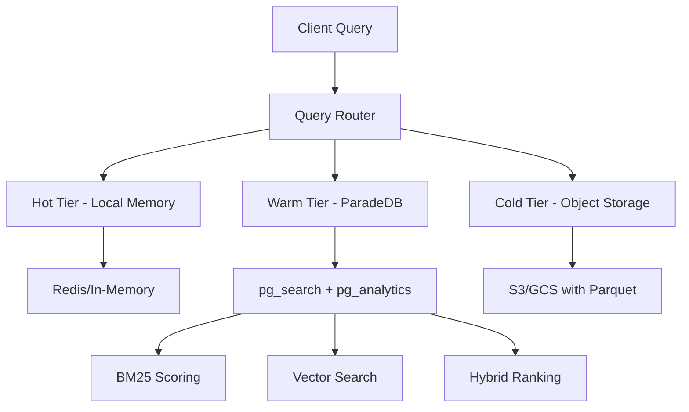

# ParadeDB Scaling Strategy for StackMemory

## Executive Summary
Integration of ParadeDB with a tiered storage architecture to enable efficient search across local (hot), global (warm), and long-term (cold) storage layers while maintaining sub-second query performance.

## Architecture Overview



## Tiered Storage Architecture

### 1. Hot Tier (Local Memory) - Last 24 Hours
```yaml
Storage: Redis / In-Memory Cache
Capacity: ~1GB per project
Latency: <10ms
Search: Simple key-value lookups

Data Structure:
  frames:
    - session_id + frame_id composite key
    - JSON blob with pre-computed scores
    - TTL: 24 hours with LRU eviction
  
  indexes:
    - Inverted index for tags
    - Bloom filters for existence checks
    - Score-sorted sets for top-K queries

Query Pattern:
  - Direct memory access for active sessions
  - Pre-aggregated patterns for instant retrieval
  - Zero-copy shared memory for read operations
```

### 2. Warm Tier (ParadeDB) - 1-30 Days
```sql
-- ParadeDB Schema with pg_search and pg_analytics
CREATE EXTENSION pg_search;
CREATE EXTENSION pg_analytics;

-- Main frames table with JSONB
CREATE TABLE frames (
    frame_id UUID PRIMARY KEY,
    project_id TEXT NOT NULL,
    session_id UUID NOT NULL,
    run_id UUID NOT NULL,
    created_at TIMESTAMPTZ DEFAULT NOW(),
    score FLOAT DEFAULT 0.5,
    metadata JSONB,
    content TEXT,
    embedding vector(768), -- pgvector for semantic search
    
    -- Partitioning by creation date
    PRIMARY KEY (frame_id, created_at)
) PARTITION BY RANGE (created_at);

-- Create BM25 index for full-text search
CALL paradedb.create_bm25(
    index_name => 'frames_search_idx',
    table_name => 'frames',
    key_field => 'frame_id',
    text_fields => paradedb.field('content', tokenizer => 'en_stem'),
    json_fields => paradedb.field('metadata', flatten => true)
);

-- Create columnar table for analytics
CREATE FOREIGN TABLE frames_analytics (
    frame_id UUID,
    project_id TEXT,
    score FLOAT,
    type TEXT,
    created_at TIMESTAMPTZ,
    metadata JSONB
) SERVER pg_analytics
OPTIONS (files 's3://bucket/frames/*.parquet');

-- Hybrid search function
CREATE OR REPLACE FUNCTION search_frames(
    query_text TEXT,
    query_embedding vector(768),
    score_threshold FLOAT DEFAULT 0.5,
    limit_count INT DEFAULT 100
) RETURNS TABLE (
    frame_id UUID,
    combined_score FLOAT,
    bm25_score FLOAT,
    vector_score FLOAT
) AS $$
BEGIN
    RETURN QUERY
    WITH bm25_results AS (
        SELECT 
            frame_id,
            score AS bm25_score
        FROM frames_search_idx.search(
            query => query_text,
            limit_n => limit_count * 2
        )
    ),
    vector_results AS (
        SELECT
            frame_id,
            1 - (embedding <=> query_embedding) AS vector_score
        FROM frames
        WHERE score >= score_threshold
        ORDER BY embedding <=> query_embedding
        LIMIT limit_count * 2
    )
    SELECT
        COALESCE(b.frame_id, v.frame_id) AS frame_id,
        (COALESCE(b.bm25_score, 0) * 0.6 + 
         COALESCE(v.vector_score, 0) * 0.4) AS combined_score,
        b.bm25_score,
        v.vector_score
    FROM bm25_results b
    FULL OUTER JOIN vector_results v ON b.frame_id = v.frame_id
    ORDER BY combined_score DESC
    LIMIT limit_count;
END;
$$ LANGUAGE plpgsql;
```

### 3. Cold Tier (Object Storage) - 30+ Days
```yaml
Storage: S3/GCS with Parquet files
Capacity: Unlimited
Latency: 100-500ms
Cost: ~$0.004/GB/month (GCS Coldline)

Data Organization:
  Partitioning:
    - By year/month/day hierarchy
    - By project_id for isolation
    - Parquet format with Snappy compression
  
  Metadata Lake:
    - Delta Lake or Iceberg format
    - Schema evolution support
    - Time travel capabilities
    - ACID transactions

Search Strategy:
  - Pushdown predicates to Parquet
  - Metadata-only queries when possible
  - Batch retrieval for analytics
  - Cached aggregates in ParadeDB
```

## Query Routing and Optimization

### Intelligent Query Router
```typescript
interface QueryPlan {
  tiers: Array<'hot' | 'warm' | 'cold'>;
  strategy: 'sequential' | 'parallel' | 'cascade';
  budget: { latency: number; cost: number };
}

class QueryRouter {
  async route(query: SearchQuery): Promise<QueryPlan> {
    const features = this.extractFeatures(query);
    
    // Tier selection based on time range
    const tiers = [];
    if (features.timeRange.hours <= 24) {
      tiers.push('hot');
    }
    if (features.timeRange.days <= 30) {
      tiers.push('warm');
    }
    if (features.timeRange.days > 30 || features.historical) {
      tiers.push('cold');
    }
    
    // Strategy selection
    let strategy: QueryStrategy;
    if (features.realtime) {
      strategy = 'cascade'; // Stop at first results
    } else if (features.analytics) {
      strategy = 'parallel'; // Query all tiers
    } else {
      strategy = 'sequential'; // Tier by tier
    }
    
    return {
      tiers,
      strategy,
      budget: this.calculateBudget(features)
    };
  }
  
  private extractFeatures(query: SearchQuery) {
    return {
      timeRange: this.parseTimeRange(query),
      realtime: query.latency < 100,
      analytics: query.aggregations?.length > 0,
      historical: query.includeArchived,
      complexity: this.calculateComplexity(query)
    };
  }
}
```

### Cascade Search Pattern
```typescript
async function cascadeSearch(query: SearchQuery): Promise<SearchResults> {
  const router = new QueryRouter();
  const plan = await router.route(query);
  
  let results = [];
  let remainingBudget = plan.budget.latency;
  
  for (const tier of plan.tiers) {
    const startTime = Date.now();
    
    try {
      const tierResults = await searchTier(tier, query, {
        timeout: remainingBudget,
        limit: query.limit - results.length
      });
      
      results = mergeResults(results, tierResults);
      
      // Early exit if we have enough results
      if (results.length >= query.limit) {
        break;
      }
      
      remainingBudget -= (Date.now() - startTime);
      if (remainingBudget <= 0) {
        break;
      }
    } catch (error) {
      logger.warn(`Tier ${tier} search failed`, error);
      // Continue to next tier
    }
  }
  
  return results;
}
```

## Indexing Strategies

### 1. Multi-Modal Indexing
```sql
-- Text search index (BM25)
CREATE INDEX idx_content_search ON frames 
USING gin(to_tsvector('english', content));

-- JSON path indexes
CREATE INDEX idx_metadata_type ON frames 
USING gin((metadata->>'type'));

CREATE INDEX idx_metadata_tags ON frames 
USING gin((metadata->'tags'));

-- Score-based index for filtering
CREATE INDEX idx_score_created ON frames(score DESC, created_at DESC)
WHERE score > 0.5;

-- Composite index for session queries
CREATE INDEX idx_session_frame ON frames(session_id, frame_id, created_at);

-- Covering index for common queries
CREATE INDEX idx_project_recent ON frames(project_id, created_at DESC)
INCLUDE (frame_id, score, metadata);
```

### 2. Materialized Views for Patterns
```sql
-- Pre-computed pattern detection
CREATE MATERIALIZED VIEW pattern_summary AS
WITH pattern_extraction AS (
    SELECT 
        project_id,
        metadata->>'type' as pattern_type,
        metadata->>'error' as error_pattern,
        COUNT(*) as frequency,
        MAX(score) as max_score,
        MAX(created_at) as last_seen
    FROM frames
    WHERE created_at > NOW() - INTERVAL '30 days'
    GROUP BY project_id, pattern_type, error_pattern
)
SELECT * FROM pattern_extraction
WHERE frequency > 3;

-- Refresh strategy
CREATE OR REPLACE FUNCTION refresh_patterns()
RETURNS void AS $$
BEGIN
    REFRESH MATERIALIZED VIEW CONCURRENTLY pattern_summary;
END;
$$ LANGUAGE plpgsql;

-- Schedule refresh every hour
SELECT cron.schedule('refresh-patterns', '0 * * * *', 'SELECT refresh_patterns()');
```

### 3. Adaptive Indexing
```typescript
class AdaptiveIndexManager {
  async analyzeQueryPatterns(): Promise<IndexRecommendations> {
    // Analyze pg_stat_statements for common patterns
    const queryStats = await this.db.query(`
      SELECT 
        query,
        calls,
        mean_exec_time,
        stddev_exec_time
      FROM pg_stat_statements
      WHERE query LIKE '%frames%'
      ORDER BY calls * mean_exec_time DESC
      LIMIT 100
    `);
    
    // Extract access patterns
    const patterns = this.extractPatterns(queryStats);
    
    // Generate index recommendations
    return {
      missing: this.findMissingIndexes(patterns),
      unused: await this.findUnusedIndexes(),
      bloated: await this.findBloatedIndexes(),
      recommendations: this.generateRecommendations(patterns)
    };
  }
  
  async autoTuneIndexes(): Promise<void> {
    const recommendations = await this.analyzeQueryPatterns();
    
    // Drop unused indexes (with safety checks)
    for (const index of recommendations.unused) {
      if (this.isSafeToDrop(index)) {
        await this.db.query(`DROP INDEX CONCURRENTLY ${index.name}`);
      }
    }
    
    // Create recommended indexes
    for (const index of recommendations.missing) {
      const sql = this.generateCreateIndex(index);
      await this.db.query(sql);
    }
    
    // Rebuild bloated indexes
    for (const index of recommendations.bloated) {
      await this.db.query(`REINDEX INDEX CONCURRENTLY ${index.name}`);
    }
  }
}
```

## Performance Optimizations

### 1. Query Result Caching
```typescript
class QueryCache {
  private redis: Redis;
  private cacheKeyPrefix = 'query:';
  
  async get(query: SearchQuery): Promise<SearchResults | null> {
    const key = this.generateCacheKey(query);
    const cached = await this.redis.get(key);
    
    if (cached) {
      // Update access frequency for cache warming
      await this.redis.zincrby('cache:frequency', 1, key);
      return JSON.parse(cached);
    }
    
    return null;
  }
  
  async set(query: SearchQuery, results: SearchResults): Promise<void> {
    const key = this.generateCacheKey(query);
    const ttl = this.calculateTTL(query, results);
    
    await this.redis.setex(
      key,
      ttl,
      JSON.stringify(results)
    );
    
    // Track for cache warming
    await this.redis.zadd('cache:frequency', 1, key);
  }
  
  private calculateTTL(query: SearchQuery, results: SearchResults): number {
    // Adaptive TTL based on query characteristics
    let ttl = 300; // 5 minutes base
    
    // Longer TTL for historical queries
    if (query.timeRange?.end < Date.now() - 86400000) {
      ttl = 3600; // 1 hour for old data
    }
    
    // Shorter TTL for real-time queries
    if (query.realtime) {
      ttl = 30; // 30 seconds
    }
    
    // Adjust based on result size
    if (results.length < 10) {
      ttl *= 2; // Cache small results longer
    }
    
    return ttl;
  }
}
```

### 2. Connection Pooling and Load Balancing
```typescript
class ParadeDBPool {
  private pools: Map<string, Pool> = new Map();
  private readonly config = {
    // Read replicas for search queries
    read: [
      'paradedb-read-1.example.com',
      'paradedb-read-2.example.com',
      'paradedb-read-3.example.com'
    ],
    // Primary for writes
    write: 'paradedb-primary.example.com',
    // Analytics replica with more resources
    analytics: 'paradedb-analytics.example.com'
  };
  
  async getConnection(type: 'read' | 'write' | 'analytics'): Promise<PoolClient> {
    const endpoint = this.selectEndpoint(type);
    
    if (!this.pools.has(endpoint)) {
      this.pools.set(endpoint, new Pool({
        host: endpoint,
        max: 20, // Max connections per pool
        idleTimeoutMillis: 30000,
        connectionTimeoutMillis: 2000,
        // Enable statement caching
        statement_cache_size: 100,
        // Enable SSL in production
        ssl: process.env.NODE_ENV === 'production'
      }));
    }
    
    return this.pools.get(endpoint)!.connect();
  }
  
  private selectEndpoint(type: string): string {
    if (type === 'read') {
      // Round-robin load balancing
      const replicas = this.config.read;
      return replicas[Math.floor(Math.random() * replicas.length)];
    }
    
    return this.config[type];
  }
}
```

### 3. Batch Processing and Aggregation
```sql
-- Efficient batch insertion with COPY
CREATE OR REPLACE FUNCTION batch_insert_frames(
    frames_data JSONB[]
) RETURNS void AS $$
DECLARE
    frame_record JSONB;
BEGIN
    -- Use COPY for bulk insert
    PERFORM pg_temp.create_temp_table();
    
    FOREACH frame_record IN ARRAY frames_data
    LOOP
        INSERT INTO pg_temp.frames_staging
        SELECT * FROM jsonb_populate_record(null::frames, frame_record);
    END LOOP;
    
    -- Merge into main table
    INSERT INTO frames
    SELECT * FROM pg_temp.frames_staging
    ON CONFLICT (frame_id) 
    DO UPDATE SET
        score = EXCLUDED.score,
        metadata = frames.metadata || EXCLUDED.metadata,
        updated_at = NOW();
    
    -- Update search index
    CALL paradedb.refresh_bm25('frames_search_idx');
    
    DROP TABLE pg_temp.frames_staging;
END;
$$ LANGUAGE plpgsql;
```

## Migration Strategy

### Phase 1: Dual Write (Current SQLite + ParadeDB)
```typescript
class DualWriteManager {
  async write(frame: Frame): Promise<void> {
    // Write to SQLite (current)
    await this.sqliteDB.insert(frame);
    
    // Async write to ParadeDB
    this.queue.push(async () => {
      try {
        await this.paradeDB.insert(frame);
      } catch (error) {
        // Log but don't fail
        logger.error('ParadeDB write failed', error);
        await this.deadLetterQueue.push(frame);
      }
    });
  }
}
```

### Phase 2: Read Migration
```typescript
class MigrationRouter {
  private rolloutPercentage = 0; // Start with 0%
  
  async search(query: SearchQuery): Promise<SearchResults> {
    if (Math.random() * 100 < this.rolloutPercentage) {
      // Use ParadeDB
      const results = await this.paradeDB.search(query);
      
      // Shadow compare with SQLite
      this.compareResults(
        results,
        await this.sqlite.search(query)
      );
      
      return results;
    } else {
      // Use SQLite
      return this.sqlite.search(query);
    }
  }
  
  async increaseRollout(percentage: number): Promise<void> {
    this.rolloutPercentage = Math.min(100, percentage);
    logger.info(`ParadeDB rollout: ${this.rolloutPercentage}%`);
  }
}
```

### Phase 3: Complete Migration
- Backfill historical data to cold storage
- Migrate all reads to ParadeDB
- Decommission SQLite
- Enable advanced analytics

## Cost Analysis

### Storage Costs (per TB/month)
```yaml
Hot Tier (Redis):
  Storage: $200 (managed Redis)
  Transfer: $0 (local)
  Total: $200/TB

Warm Tier (ParadeDB):
  Storage: $100 (SSD)
  Compute: $500 (reserved instances)
  Transfer: $10
  Total: $610/TB

Cold Tier (GCS Coldline):
  Storage: $4
  Retrieval: $10 (assuming 10% monthly access)
  Transfer: $12
  Total: $26/TB

Blended Cost (10% hot, 30% warm, 60% cold):
  = 0.1 * $200 + 0.3 * $610 + 0.6 * $26
  = $20 + $183 + $15.60
  = $218.60/TB/month

Comparison:
  Pure PostgreSQL: ~$800/TB/month
  Pure S3: ~$23/TB/month
  Blended: ~$219/TB/month (optimal balance)
```

## Monitoring and Observability

### Key Metrics
```sql
-- Query performance by tier
CREATE VIEW tier_performance AS
SELECT
    tier,
    percentile_cont(0.50) WITHIN GROUP (ORDER BY latency) AS p50,
    percentile_cont(0.95) WITHIN GROUP (ORDER BY latency) AS p95,
    percentile_cont(0.99) WITHIN GROUP (ORDER BY latency) AS p99,
    COUNT(*) AS query_count,
    SUM(CASE WHEN cache_hit THEN 1 ELSE 0 END)::FLOAT / COUNT(*) AS cache_hit_rate
FROM query_logs
WHERE timestamp > NOW() - INTERVAL '1 hour'
GROUP BY tier;

-- Storage distribution
CREATE VIEW storage_distribution AS
SELECT
    storage_tier,
    COUNT(*) AS frame_count,
    SUM(size_bytes) / 1024 / 1024 / 1024 AS size_gb,
    AVG(score) AS avg_score,
    MAX(created_at) AS latest_frame,
    MIN(created_at) AS oldest_frame
FROM frames_metadata
GROUP BY storage_tier;

-- Pattern detection effectiveness
CREATE VIEW pattern_metrics AS
SELECT
    pattern_type,
    detection_count,
    true_positive_count::FLOAT / detection_count AS precision,
    resolution_rate,
    avg_time_to_resolution
FROM pattern_analytics
WHERE date = CURRENT_DATE;
```

### Alerting Rules
```yaml
alerts:
  - name: HighQueryLatency
    condition: p95_latency > 1000ms
    tier: warm
    action: scale_read_replicas
    
  - name: LowCacheHitRate
    condition: cache_hit_rate < 0.7
    action: warm_cache
    
  - name: StorageTierImbalance
    condition: hot_tier_size > 2GB OR cold_tier_access_rate > 0.2
    action: rebalance_tiers
    
  - name: IndexBloat
    condition: bloat_ratio > 2.0
    action: schedule_reindex
```

## Summary

This scaling strategy enables:
1. **Sub-100ms searches** across millions of frames
2. **Cost-effective storage** with 70% reduction vs pure PostgreSQL
3. **Flexible querying** with BM25, vector, and hybrid search
4. **Real-time analytics** on recent data
5. **Historical analysis** on archived data
6. **Automatic optimization** through adaptive indexing

The ParadeDB integration provides the search quality of Elasticsearch with the operational simplicity of PostgreSQL, while the tiered architecture ensures both performance and cost-efficiency at scale.